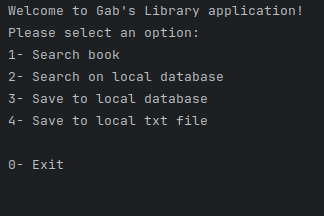
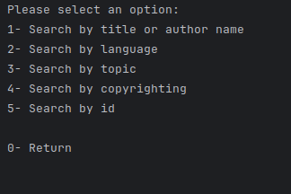
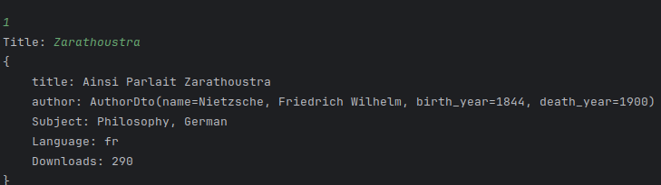
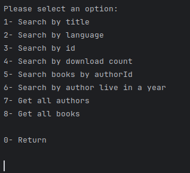
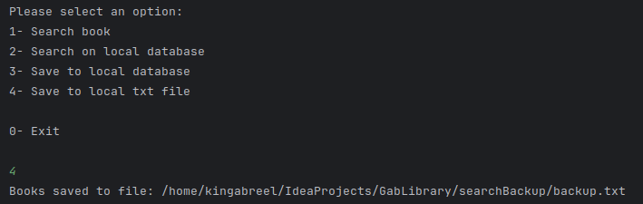

# Library Management System

## Alura Project - ONE

## `one.alura.gablibrary.view.ConsoleApp`

### Overview
This class represents the console application interface for the Gab's Library application. It provides functionalities for searching books, managing the local database, and saving data to local files.

### Usage
1. Instantiate the `ConsoleApp` class.
2. Interact with the console interface to perform various operations like searching books, saving to the local database, or exiting the application.

### Methods

- `showMainOption()`: Displays the main options menu and handles user input for selecting operations like searching books, saving to the local database, or exiting the application.

- `showSearchOptions()`: Displays the search options menu and handles user input for searching books by different criteria like title, language, topic, etc.

- `showLocalSearchOption()`: Displays the local search options menu and handles user input for searching books from the local database by various criteria.

- `saveBook(Book book)`: Saves the provided book to the local database.

---

## `one.alura.gablibrary.service.LibraryService`

### Overview
This class provides service methods for interacting with the library database. It includes functionalities for saving books and authors, retrieving books and authors, and searching books by various criteria.

### Methods

- `saveBook(Book book)`: Saves the provided book to the database after checking if the associated author exists.

- `saveAuthor(Author author)`: Saves the provided author to the database.

- `getAllAuthor()`: Retrieves all authors from the database and converts them to DTOs for presentation.

- `findAuthorsAliveInYear(int year)`: Finds authors who were alive in the specified year.

- `getAllLocalBooks()`: Retrieves all books from the local database and converts them to DTOs for presentation.

- `getBooksBySearch(String term)`: Searches books from an external API based on the provided search term.

- `getBooksByLanguage(String language)`: Searches books from an external API based on the provided language.

- `searchByTopic(String topicSearch)`: Searches books from an external API based on the provided topic.

- `searchByCopyRighting(boolean y)`: Searches books from an external API based on the copyrighting status.

- `searchById(int entityId)`: Searches books from an external API based on the provided entity ID.

- `searchLocalById(Long id)`: Searches for a book in the local database based on the provided ID.

- `searchLocalByTitle(String title)`: Searches for books in the local database based on the provided title.

- `searchLocalByLanguage(String language)`: Searches for books in the local database based on the provided language.

- `searchLocalByDownloadCount(Long min)`: Searches for books in the local database based on the minimum download count.

- `searchLocalByAuthorId(Long authorId)`: Searches for books in the local database based on the author ID.

---

## `one.alura.gablibrary.controller.ConsoleAppController`

### Overview
This class serves as the controller for the console application, bridging the view (`ConsoleApp`) and service (`LibraryService`) layers. It handles user input from the console interface and delegates operations to the service layer.

### Methods

- `saveLocalDb(List<BookDto> bookList)`: Saves the provided list of book DTOs to the local database.

- `saveAuthor(Author author)`: Saves the provided author to the database.

- `getAllAuthor()`: Retrieves all authors from the database via the service layer.

- `findAuthorsAliveInYear(int year)`: Finds authors who were alive in the specified year via the service layer.

- `getAllLocalBooks()`: Retrieves all books from the local database via the service layer.

- `searchByTitleOrName(String title)`: Searches books from an external API based on the provided title or author name.

- `searchByLanguage(String language)`: Searches books from an external API based on the provided language.

- `languageAccepted(String language)`: Checks if the provided language is accepted for searching.

- `saveToLocalTxt(List<BookDto> books)`: Saves the provided list of book DTOs to a local text file.

- `searchByTopic(String topicSearch)`: Searches books from an external API based on the provided topic.

- `searchByCopyrighting(boolean y)`: Searches books from an external API based on the copyrighting status.

- `searchById(int id)`: Searches books from an external API based on the provided ID.

- `searchLocalByTitle(String title)`: Searches for books in the local database based on the provided title.

- `searchLocalByLanguage(String language)`: Searches for books in the local database based on the provided language.

- `searchLocalById(int bookId)`: Searches for a book in the local database based on the provided ID.

- `searchLocalByDownloadCount(int downCount)`: Searches for books in the local database based on the minimum download count.

- `searchLocalByAuthorId(int authorId)`: Searches for books in the local database based on the author ID.

---

## `one.alura.gablibrary.controller.external.ApiRequest`

### Overview
This class is responsible for making HTTP requests to an external API for fetching books based on provided query parameters.

### Methods

- `fetchBooks(Map<String, String> queryParams)`: Sends an HTTP GET request to the external API with the provided query parameters and retrieves the response.

---

## `one.alura.gablibrary.controller.external.ApiResponse`

### Overview
This class represents the response structure from the external API. It contains metadata like count, next page URL, previous page URL, and a list of book responses.

---

## `one.alura.gablibrary.controller.external.BookResponse`

### Overview
This class represents a single book response from the external API. It includes attributes like ID, title, authors, subjects, languages, download count, etc.

---

These documentations are based on the provided classes. Let me know if you need further explanations or modifications!

Application Screenshots (v1)

